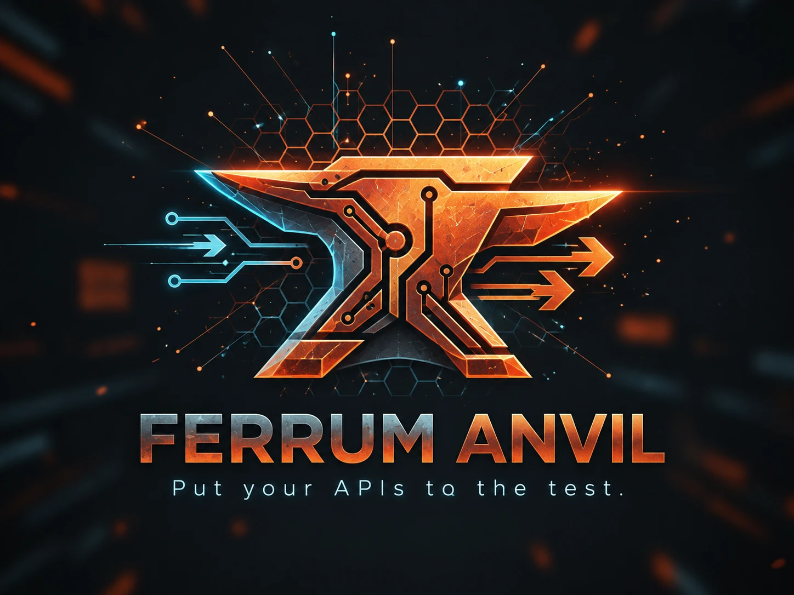

<p align="center">
  
</p>

<h1 align="center">Ferrum Anvil</h1>

<p align="center"><b>Put your APIs to the test.</b></p>

<p align="center">
  <a href="https://github.com/ferrum-edge/ferrum-anvil/actions/workflows/ci.yml"></a>
  <a href="https://github.com/ferrum-edge/ferrum-anvil/actions/workflows/e2e.yml"></a>
  <a href="https://github.com/ferrum-edge/ferrum-anvil/actions/workflows/lab.yml"></a>
  <a href="https://github.com/ferrum-edge/ferrum-anvil/actions/workflows/release.yml"></a>
  <a href="LICENSE"></a>
  
</p>

A local-first API client for desktop and the command line. Send requests,
run tests and load tests, and get failure explanations based on what actually
happened on the wire. No account, works offline.

> **Pre-release:** there are no signed installers yet, so build from source
> for now (see [docs/release.md](docs/release.md)).

## Features

- **Every protocol you need** — HTTP/1.1, HTTP/2, HTTP/3, WebSocket, gRPC,
  gRPC-Web, SSE, TCP/TLS and UDP/DTLS, with live interactive sessions.
- **Clear failure diagnosis** — every response is checked against the DNS,
  connect, TLS and protocol evidence, and Anvil tells you what went wrong,
  how sure it is, and what to try next.
- **Load testing** — arrival-rate, virtual-user and iteration workloads with
  percentiles, timelines, run comparison and HTML/JSON/CSV reports.
- **Auth and TLS built in** — API key, Basic, Bearer, JWT, OAuth 2.0 (incl.
  PKCE), HMAC, DPoP, mTLS, private CAs and SPIFFE identities.
- **Import from anywhere** — OpenAPI, WSDL, Postman, Insomnia, cURL and HAR.
- **Private by default** — everything is encrypted on disk, with optional
  passphrase, auto-lock and encrypted backups.
- **Ferrum Edge aware** — deeper troubleshooting for Ferrum Edge gateways
  and mesh features such as HBONE tunnels.

## Getting started

You need [Rust](https://rustup.rs) (stable), Node.js 22.23.3 and npm. On
Linux, also install [Tauri's WebKitGTK dependencies](https://tauri.app/start/prerequisites/).

```bash
# Build the desktop frontend (required before compiling the app)
cd apps/desktop && npm ci && npm run build && cd ../..

# Run the desktop app
cd apps/desktop && npx tauri dev
```

Prefer the terminal? Install the `anvil` CLI:

```bash
cargo install --path crates/anvil-cli

anvil profile create me          # passphrase via --passphrase-stdin or ANVIL_PASSPHRASE
anvil workspace create Demo
anvil add Demo "Health" --url https://example.com/health
anvil send Health --workspace Demo
anvil import-spec Demo openapi.yaml
anvil run Demo --folder Smoke --junit report.xml
```

<details>
<summary><b>For contributors: tests and the failure lab</b></summary>

```bash
cargo build --workspace
cargo test --workspace --exclude anvil-desktop
```

The failure lab runs real, pinned Ferrum Edge releases on loopback
(default v0.9.7, see `lab/gateway/RELEASE.lock`):

```bash
lab/scripts/fetch-gateway.sh                      # download + verify the pinned gateway
cargo run -p anvil-lab -- run all --untrusted-pass
cargo run -p anvil-lab -- up core                 # keep a lab up for manual testing
```

</details>

## Documentation

| Topic | Where |
|---|---|
| Protocols | [docs/protocols.md](docs/protocols.md) |
| Failure diagnostics | [docs/diagnostics.md](docs/diagnostics.md) |
| Load testing | [docs/load.md](docs/load.md) |
| Collection runner | [docs/runner.md](docs/runner.md) |
| Imports | [docs/import.md](docs/import.md) |
| Storage and recovery | [docs/storage-and-recovery.md](docs/storage-and-recovery.md) |
| Architecture | [docs/architecture.md](docs/architecture.md) |
| Security model | [docs/threat-model.md](docs/threat-model.md) |
| Failure lab | [docs/lab/](docs/lab/) |
| CI and releases | [docs/ci.md](docs/ci.md), [docs/release.md](docs/release.md) |
| What's built and what's open | [docs/completion-report.md](docs/completion-report.md) |
| Sample workspace | [samples/](samples/) |

## License

Free for noncommercial use under [PolyForm Noncommercial 1.0.0](LICENSE).
Commercial use requires a [commercial license](LICENSE-COMMERCIAL.md).
