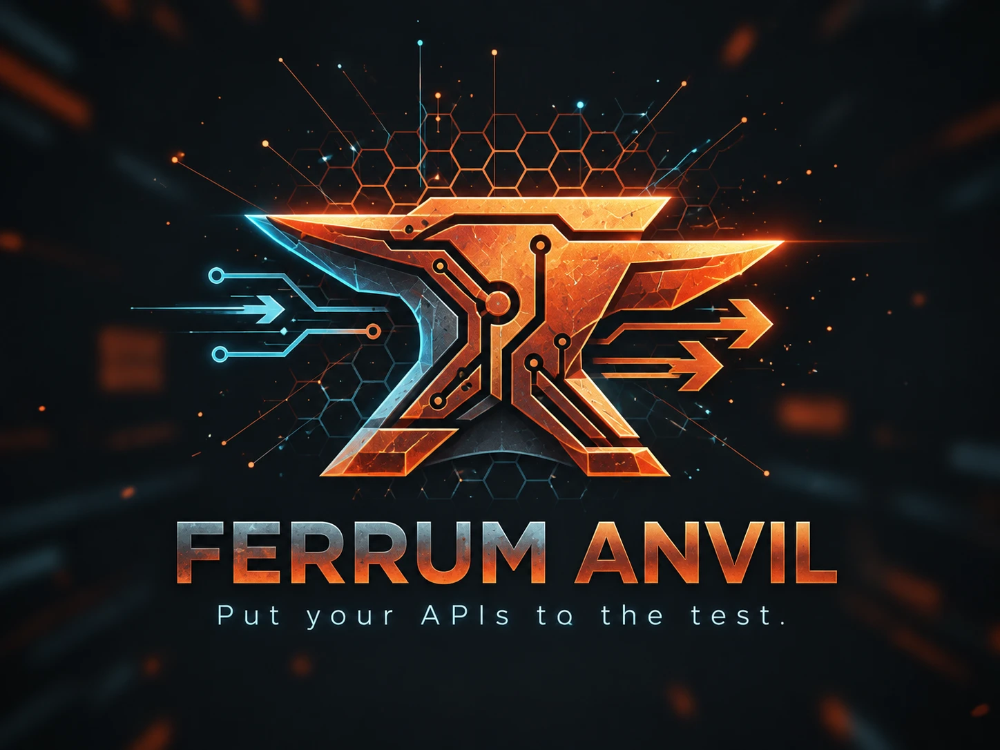

<p align="center">
  
</p>

<h1 align="center">Ferrum Anvil</h1>

<p align="center"><b>Put your APIs to the test.</b></p>

<p align="center">
  <a href="https://github.com/ferrum-edge/ferrum-anvil/actions/workflows/ci.yml"></a>
  <a href="https://github.com/ferrum-edge/ferrum-anvil/actions/workflows/e2e.yml"></a>
  <a href="https://github.com/ferrum-edge/ferrum-anvil/actions/workflows/lab.yml"></a>
  <a href="https://github.com/ferrum-edge/ferrum-anvil/actions/workflows/release.yml"></a>
  <a href="LICENSE"></a>
  
</p>

A local-first API client for desktop and the command line. Send requests,
run tests and load tests, and get failure explanations based on what actually
happened on the wire. No account, works offline.

> **Pre-release:** there are no signed installers yet, so build from source
> for now (see [docs/release.md](docs/release.md)).

## Features

- **Every protocol you need** — HTTP/1.1, HTTP/2, HTTP/3, WebSocket, gRPC,
  gRPC-Web, SSE, TCP/TLS and UDP/DTLS, with live interactive sessions.
- **Clear failure diagnosis** — every response is checked against the DNS,
  connect, TLS and protocol evidence, and Anvil tells you what went wrong,
  how sure it is, and what to try next.
- **Load testing** — arrival-rate, virtual-user and iteration workloads with
  percentiles, timelines, run comparison and HTML/JSON/CSV reports.
- **Auth and TLS built in** — API key, Basic, Bearer, JWT, OAuth 2.0 (incl.
  PKCE), HMAC, DPoP, mTLS, private CAs and SPIFFE identities.
- **Import from anywhere** — OpenAPI, WSDL, Postman, Insomnia, cURL and HAR.
- **API standards** — check OpenAPI descriptions (Swagger 2.0 to OpenAPI
  3.2) against your company's own ruleset, with the line to edit and how to
  fix each finding; SARIF output for CI.
- **Contract drift** — compare what your API actually did (your sends, or a
  HAR capture) with its OpenAPI description: undeclared paths, statuses,
  media types and properties, schema mismatches, slow or oversized calls,
  with suggested revisions you can apply and reimport.
- **Private by default** — everything is encrypted on disk, with optional
  passphrase, auto-lock and encrypted backups.
- **Ferrum Edge aware** — deeper troubleshooting for Ferrum Edge gateways
  and mesh features such as HBONE tunnels.

## Getting started

You need [Rust](https://rustup.rs) (stable), Node.js 22 or later (CI uses
22.23.3) and npm. On Linux, also install
[Tauri's WebKitGTK dependencies](https://tauri.app/start/prerequisites/).

```bash
cd apps/desktop
npm ci
npm run build    # the desktop crate embeds dist/ at compile time
npx tauri dev    # run the desktop app
```

Prefer the terminal? Install the `anvil` CLI:

```bash
cargo install --path crates/anvil-cli

anvil profile create me          # passphrase via --passphrase-stdin or ANVIL_PASSPHRASE
anvil workspace create Demo
anvil add Demo "Health" --url https://example.com/health --folder Smoke
anvil send Health --workspace Demo
anvil import-spec Demo --file openapi.yaml
anvil lint-spec openapi.yaml --ruleset api-standards.yaml
anvil spec-drift openapi.yaml --har traffic.har --revised openapi.revised.yaml
anvil run Demo --folder Smoke --junit report.xml
anvil export --workspace Demo --mode share --out demo.anvil
# Add --include-standards to include the profile's API standards (off by default).
```

<details>
<summary><b>For contributors: tests and the failure lab</b></summary>

```bash
(cd apps/desktop && npm ci && npm run build)   # the desktop crate embeds dist/
cargo build --workspace
cargo test --workspace --exclude anvil-desktop
```

The full CI command list is in [docs/ci.md](docs/ci.md#reproducing-locally).

The failure lab runs real, pinned Ferrum Edge releases on loopback
(v0.9.15 default with
[hosted Anvil qualification](docs/audit/gateway-0.9.15-delta.md#qualification-status)
recorded; earlier releases retained, see `lab/gateway/RELEASE.lock` and
[source audit](docs/audit/gateway-0.9.15-delta.md)):

```bash
lab/scripts/fetch-gateway.sh                      # download + verify the pinned gateway
cargo run -p anvil-lab -- run all --untrusted-pass
cargo run -p anvil-lab -- up core                 # keep a lab up for manual testing
```

</details>

## Documentation

| Topic | Where |
|---|---|
| Protocols | [docs/protocols.md](docs/protocols.md) |
| Failure diagnostics | [docs/diagnostics.md](docs/diagnostics.md) |
| Load testing | [docs/load.md](docs/load.md) |
| Collection runner | [docs/runner.md](docs/runner.md) |
| Imports | [docs/import.md](docs/import.md) |
| API standards and contract drift | [docs/contract.md](docs/contract.md) |
| Identities and sign-in | [docs/identity.md](docs/identity.md) |
| Storage and recovery | [docs/storage-and-recovery.md](docs/storage-and-recovery.md) |
| Architecture | [docs/architecture.md](docs/architecture.md) |
| Security model | [docs/threat-model.md](docs/threat-model.md) |
| Cookie, redirect and OAuth token policy | [docs/security/http-state-and-destination-policy.md](docs/security/http-state-and-destination-policy.md) |
| Failure lab | [docs/lab/](docs/lab/) |
| CI and releases | [docs/ci.md](docs/ci.md), [docs/release.md](docs/release.md) |
| What's built and what's open | [docs/completion-report.md](docs/completion-report.md) |
| Sample workspace | [samples/](samples/) |

## Contracts

Ferrum Edge contracts are maintained in the organization's central store:
[ferrum-contracts](https://github.com/ferrum-edge/ferrum-contracts), which
publishes shared vocabularies, JSON schemas and fixtures.
Anvil consumes gateway vocabularies and headers, the DiagnosticFinding schema
and fixtures, the diagnostic-ref v1 schema and fixtures, and the diagnostic-report
v1 schema and its shared import fixtures. These files are pinned to
`contracts-edge-0.9.15` (`6fb64c5dc2e014204c17609fc717d976f3b4589e`) in
[`contracts/ferrum-contracts/PIN`](contracts/ferrum-contracts/PIN) and vendored
under [`contracts/ferrum-contracts`](contracts/ferrum-contracts).
The published pin records the accepted unchanged shared v1 freeze; diagnostic
preview remains read-only, unverified and unknown. See
[docs/ferrum-contracts.md](docs/ferrum-contracts.md) for the pin and update process.
Shared contract changes belong in ferrum-contracts first, then are re-vendored here; they are never edited locally.

## License

Free for noncommercial use under [PolyForm Noncommercial 1.0.0](LICENSE).
Commercial use requires a [commercial license](LICENSE-COMMERCIAL.md).
